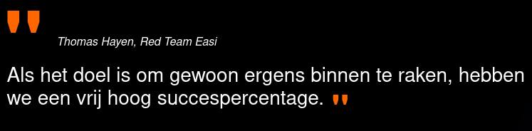
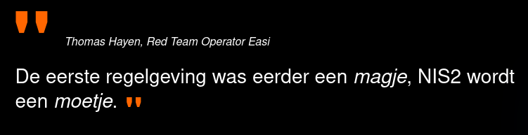

# Why Pentesting?

---

# AI and Security

---

# Tips & Tricks

---

# NIS2 - Why?

---

# NIS2 - People

---

# Sources

- [Why Pentesting?](https://itdaily.be/blogs/security/watis-een-pentest/)
- [AI and Security](https://itdaily.be/blogs/security/ai-de-oplossing-voor-het-tekort-aan-security-experts/)
- [Tips & Tricks](https://itdaily.be/blogs/security/5-beveiligingstips-voor-je-bedrijf-van-ethische-hackers/)
- [NIS2 Article - Why?](https://itdaily.be/blogs/security/nis2-wat-waarom/)
- [NIS2 Article - People](https://itdaily.be/blogs/security/nis2-goed-idee-maar-met-welke-mensen/)
