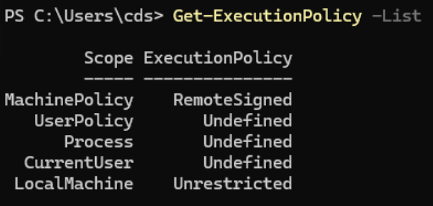
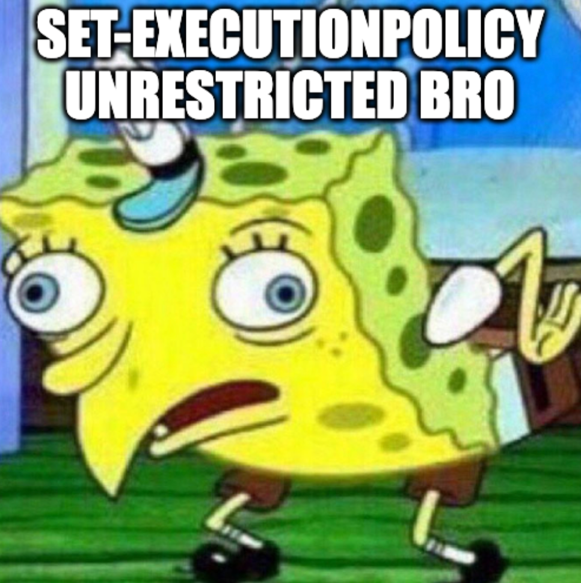
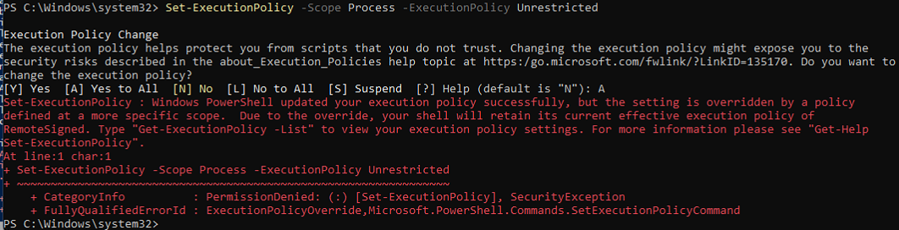
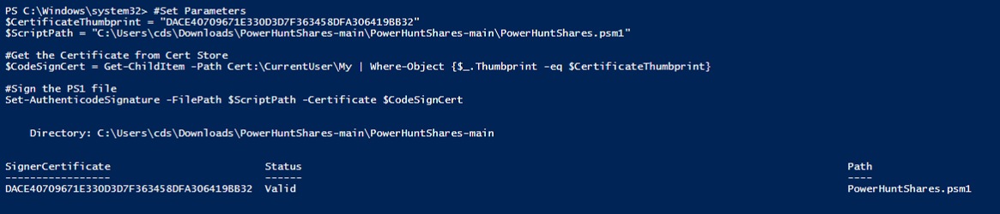
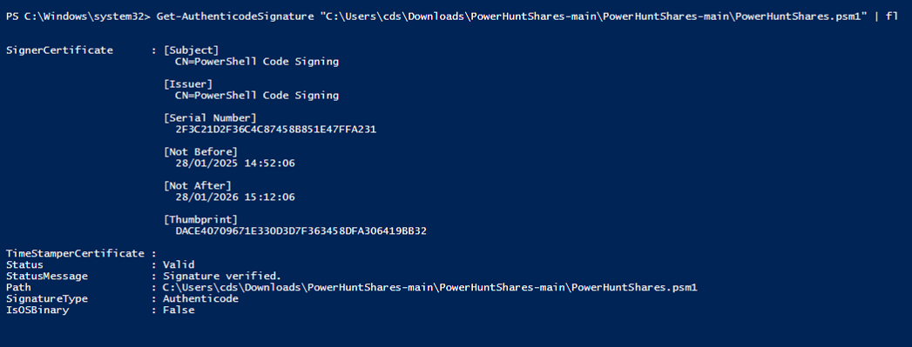
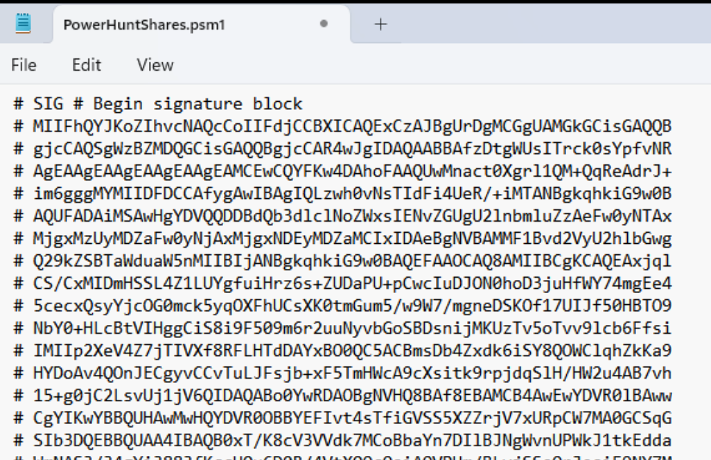
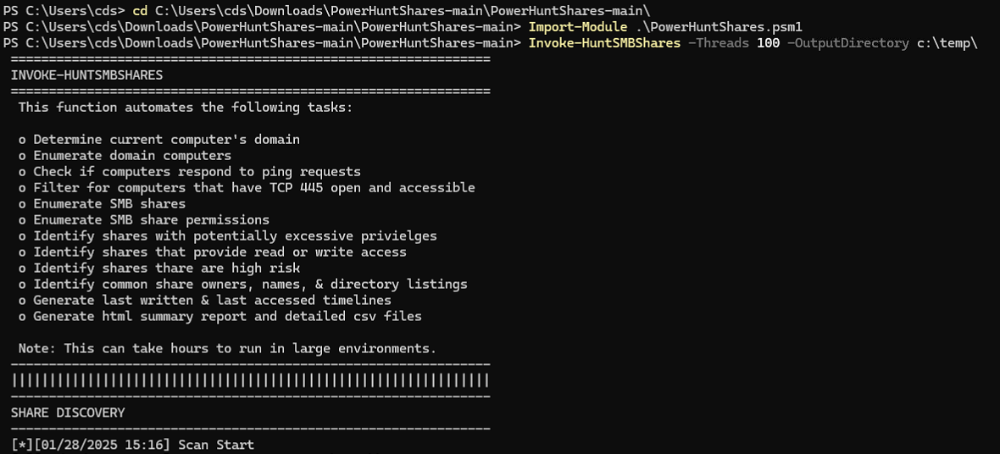

# Sign your PowerShell Scripts 
---

During a recent penetration test, I wanted to run [PowerHuntShares](https://github.com/NetSPI/PowerHuntShares), a PowerShell script designed to find secrets in shared resources and much more. If you haven't heard of it before, I highly recommend checking it out.

## RemoteSigned
---

The output of `Get-ExecutionPolicy -List` displays the execution policies defined across various scopes. Let's analyze it to understand which scripts can be executed based on the settings found on the device during the penetration test:

<figure class="centered-image">
  
  <figcaption>Figure 1 - Our Device's Execution Policy</figcaption>
</figure>

### Execution Policies in Effect
---

MachinePolicy: RemoteSigned
- Scripts downloaded from the internet must be signed by a trusted publisher.
- Local scripts (on the machine) can run without being signed.

LocalMachine: Unrestricted
- No restrictions on scripts. All scripts can run, including those downloaded from the internet. However, you may receive a warning before running a script downloaded from the internet.

### Effective Execution Policy
---

The precedence of the execution policy order is determined by the highest priority scope with a defined policy. The [priority order](https://learn.microsoft.com/en-us/powershell/module/microsoft.powershell.core/about/about_execution_policies?view=powershell-7.5) is:

1. MachinePolicy: Set by a Group Policy for all users of the computer.
2. UserPolicy: Set by a Group Policy for the current user of the computer.
3. Process: The Process scope only affects the current PowerShell session. The execution policy is saved in the environment variable `$env:PSExecutionPolicyPreference`, rather than the configuration file. When the PowerShell session is closed, the variable and value are deleted.
4. CurrentUser: The execution policy affects only the current user. It's stored in the CurrentUser configuration file.
5. LocalMachine: The execution policy affects all users on the current computer. It's stored in the AllUsers configuration file.

<br>Based on our output, the effective execution policy is **RemoteSigned** because it is set at the MachinePolicy scope, which takes precedence over LocalMachine.

### What Scripts Can Be Executed?
---

Given the RemoteSigned policy in effect:

**Allowed**:
- Scripts written and stored locally.
- Scripts downloaded from the internet, if they are digitally signed by a trusted publisher.

<br>**Blocked**:
- Unsigned scripts downloaded from the internet.

### Set-ExecutionPolicy
---

Just set your execution policy to unrestricted bro. Well it is set through a GPO and scoped to LocalMachine...

<figure class="centered-image">
  
  <figcaption>Figure 2 - Set-ExecutionPolicy Unrestricted</figcaption>
</figure>

```powershell
Set-ExecutionPolicy -Scope Process -ExecutionPolicy Unrestricted
```

<figure class="centered-image large">
  
  <figcaption>Figure 3 - Setting the execution policy</figcaption>
</figure>


# Signing PowerHuntShares
---

So how do we go about signing our own powershell script? To start, you'll need a self-signed certificate. This certificate will act as the key to sign your script. The following PowerShell commands will generate the certificate:

```powershell
#Parameters
$CertificateName = "PowerShell Code Signing"
 
#Create a Self-Signed SSL certificate
$Certificate = New-SelfSignedCertificate -CertStoreLocation Cert:\CurrentUser\My -Subject "CN=$CertificateName" -KeySpec Signature -Type CodeSigningCert
 
#Export the Certificate to "Documents" Folder in your computer
$CertificatePath = [Environment]::GetFolderPath("MyDocuments")+"\$CertificateName.cer"
Export-Certificate -Cert $Certificate -FilePath $CertificatePath
 
#Add Certificate to the "Trusted Root Store"
Get-Item $CertificatePath | Import-Certificate -CertStoreLocation "Cert:\LocalMachine\Root"
  
Write-host "Certificate Thumbprint:" $Certificate.Thumbprint
```

As shown in **Figure 4**, this process generates a self-signed certificate with a thumbprint that you'll use in subsequent steps.

<figure class="centered-image large">
  
  <figcaption>Figure 4 - Generating a self-signed certificate</figcaption>
</figure>

Once your certificate is ready, it’s time to sign the PowerHuntShares script. This step is critical to ensure the script runs on machines with restricted execution policies. Here's how to sign the script:

```powershell
#Set Parameters
$CertificateThumbprint = "DACE40709671E330D3D7F363458DFA306419BB32"
$ScriptPath = "C:\Users\cds\Downloads\PowerHuntShares-main\PowerHuntShares-main\PowerHuntShares.psm1"
 
#Get the Certificate from Cert Store
$CodeSignCert = Get-ChildItem -Path Cert:\CurrentUser\My | Where-Object {$_.Thumbprint -eq $CertificateThumbprint}
 
#Sign the PS1 file
Set-AuthenticodeSignature -FilePath $ScriptPath -Certificate $CodeSignCert
```

In **Figure 5**, you can see the signed PowerHuntShares script with its certificate applied successfully.

<figure class="centered-image large">
  
  <figcaption>Figure 5 - Signed PowerHuntShares.psm1</figcaption>
</figure>

After signing, it’s good practice to verify the script’s signature to ensure the process worked as intended. Run the following command to check:

```powershell
Get-AuthenticodeSignature "C:\Users\cds\Downloads\PowerHuntShares-main\PowerHuntShares-main\PowerHuntShares.psm1" | fl
```

As seen in **Figure 6** & **Figure 7**, which confirm the script is properly signed, making it ready for execution.

<figure class="centered-image large">
  
  <figcaption>Figure 6 - PowerHuntShares Signed pt1</figcaption>
</figure>

<figure class="centered-image large">
  
  <figcaption>Figure 7 - PowerHuntShares Signed pt2</figcaption>
</figure>

## Running the signed script
---

With the script signed, you can now execute it seamlessly, even in environments with restrictive execution policies. By using Invoke-HuntSMBShares, you can automate the discovery of SMB shares efficiently.

<figure class="centered-image large">
  
  <figcaption>Figure 7 - Successful run of Invoke-HuntSMBShares</figcaption>
</figure>

# Sources
---
- [PowerShell Basics - Execution Policy and Code Signing Part 1](https://www.darkoperator.com/blog/2013/3/5/powershell-basics-execution-policy-part-1.html)
- [How to Sign a PowerShell Script: A Step-by-Step Guide](https://www.sharepointdiary.com/2020/12/how-to-sign-powershell-script.html)