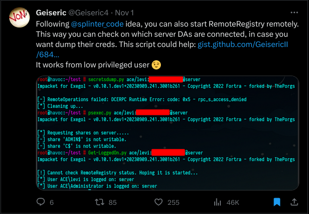

# Remote Registry to enumerate the logged on users?
---

During red team operations we, more time than not, are targeting the Active Directory. We have all been in the situation that we quickly want to check wether or not users are connected/logged in to certain devices, for let's say dumping their credentials if they are. Some tools already help us with that, for example Bloodhound/Sharphound does session enumeration using:

- NetWkstaUserEnum
- NetSessionEnum
- Remote Registry

And however it is quite easy to just run Sharphound or Bloodhound.py, it might be the case that we cannot open a socks proxy or just run a .NET assembly in memory without being detected. So how to fix this? Well I tried writing a quick a dirty Cobalt Strike BOF to help us with just that.

# Original Idea

So a while back I saw this tweet from <a src="https://twitter.com/Geiseric4">@Geiseric4</a>: 

He tweeted about a python script that does just what we want to accomplish with our BOF:

- Start the Remote Registry (if not running)
- Session enumeration using Remote Registry
- SID to accountname conversion

# Project

WIP - BOF almost ready
[Cobalt Strike - GetLoggedOn BOF](https://github.com/0xSH4RKS/getloggedonBOF)

# Sources

- [Bloodhound Inner Workings - Part 3](https://blog.compass-security.com/2022/05/bloodhound-inner-workings-part-3/)