# What is this and why should I read it?
---

This is a small blogpost series I would like to start to showcase some cool attack paths we found during red teams or penetration tests with some extra bits & pieces here and there. Obviously it will be redacted so that it cannot be retraced to what environment or sometimes even recreated in lab environments.

<figure class="centered-image">
  
  <figcaption>Figure 1 - Oh shit, here we go again...</figcaption>
</figure>

If this triggered your interest, defintely read on! This episode we will be following a path at a customer during a penetration test. At this customer we chose to perform an assumed breach penetration test, at this point we have full access to a Windows 10 device, setup following policies and procedures of the customer.

<figure class="centered-image">
  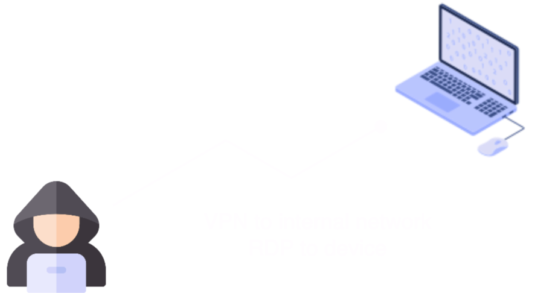
  <figcaption>Figure 2 - Current Access Level</figcaption>
</figure>


# Mapping the Active Directory 
---

One of the first things I always like to do is to map out the Active Directory using [BloodHound](https://bloodhound.readthedocs.io/en/latest/index.html). Sidenote, the scope of the engagement didn't include evasion or tackling EDR on the endpoint we received access to.

Starting on engagements I like to always have a C2 framework to work with, this engagement (and last ones for that matter) I utilised [Mythic](https://github.com/its-a-feature/Mythic). Dropping a simple agent on the endpoint (example underneath for reference) allows us to have a quick way to utilise offensive tools.

<figure class="centered-image large">
  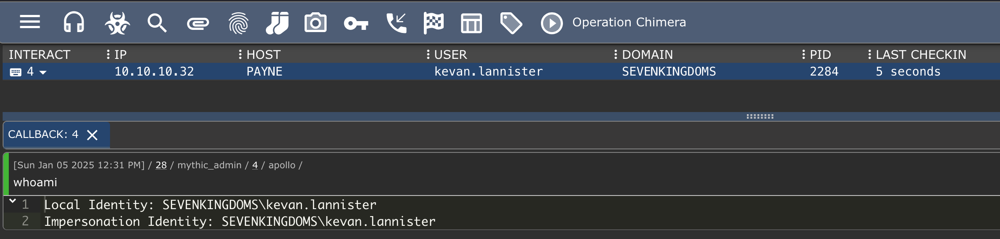
  <figcaption>Figure 3 - Mythic Console (Simulated)</figcaption>
</figure>

To utilise BloodHound, which basically is just a front-end application utilising neo4j and graphing theory to map out attack paths, we still need to have data that can be ingested by Neo4j & BloodHound. To ingest data from an Active Directory we can utilise BloodHounds ingestors:

- [SharpHound](https://github.com/SpecterOps/SharpHound)
- [BloodHound.py](https://github.com/dirkjanm/BloodHound.py)
- [ShadowHound](https://github.com/Friends-Security/ShadowHound)
- [BOFHound](https://github.com/fortalice/bofhound) (using ADExplorer Snapshots)
- [RustHound](https://github.com/NH-RED-TEAM/RustHound)
- and probably many more

<br>We could easily drop one of the previously mentioned tools to disk (after compilation) and execute it, but we have an active Mythic Agent on our testing machine, so why not utilise it? We can execute arbitrary C# tools using the built-in command (in the Apollo agent) execute_assembly. Before being able to run execute_assembly we need to run register_assembly to import a new assembly into the agents cache.

# Running C# Assemblies through Apollo
---

The technique of running C# tooling in-memory is widely known, most C2 frameworks have the option/command to do something similar. Some also are able to execute it from memory more stealthily then others. 

For us, using Apollo, we will need to register the assembly into the agent's cache before we can execute it. As with every tool, it is worth to know what is happening in the process for it to register the assembly and execute it. Looking at the agents process before loading in the assembly we can see multiple AppDomains already registered. 

<figure class="centered-image">
  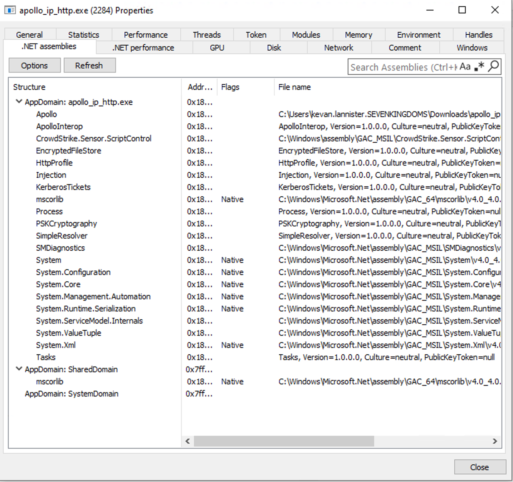
  <figcaption>Figure 4 - Apollo Agent Before Registering the Assembly (Simulated)</figcaption>
</figure>

## register_assembly

Looking at the documentation, it states that the assembly will be loaded into the agent's cache encrypted at rest using AES256 and only decrypted upon task execution. It also mentions that it is just a wrapper around the function `register_file`. Looking into that function shows us 


So let's execute the task, the help menu will show us that a popup will allow us to upload the C# assembly and register it into the agent's 'cache'.

<figure class="centered-image">
  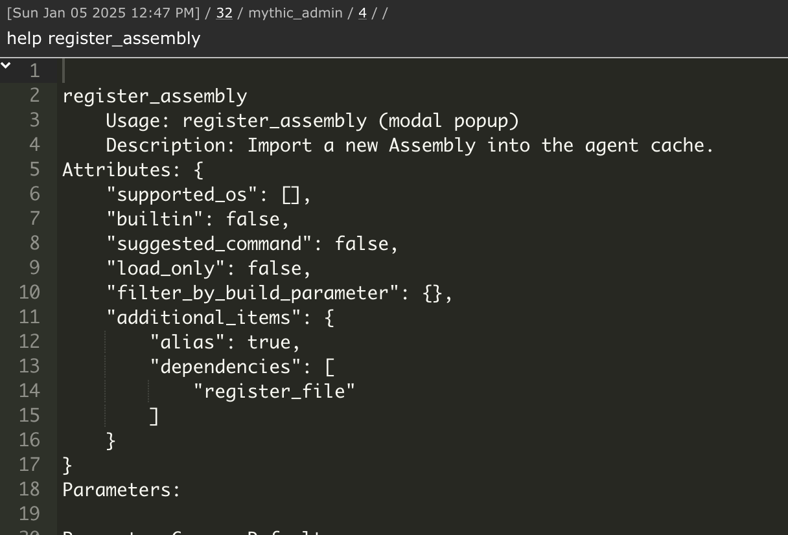
  <figcaption>Figure 5 - Help register_assembly</figcaption>
</figure>

We select SharpHound.exe, I have downloaded the [SharpCollection](https://github.com/Flangvik/SharpCollection) to make it easy but remember kids: never execute pre-compiled binaries into your client's environments...

<figure class="centered-image large">
  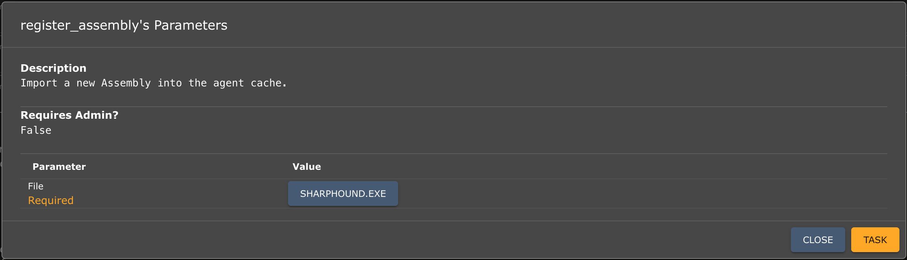
  <figcaption>Figure 6 - Execute register_assembly</figcaption>
</figure>

Now what is actually happening and where is our assembly going? In the screenshot underneath you can see that when we toggle a breakpoint on the `AddFileToStore` function, this showcases that the binary is indeed going to be added somewhere.

<figure class="centered-image large">
  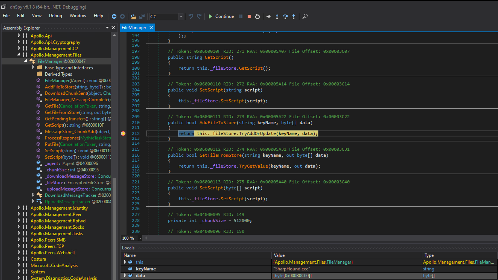
  <figcaption>Figure 6 - Debugging Apollo's Encrypted filestore</figcaption>
</figure>

Based on the source code we could see that a "filestore" is created upon the process initiation using AES256 encryption. 

```c#
private EncryptedFileStore _fileStore { get; set; }

public FileManager(IAgent agent)
{
    _agent = agent;
    _fileStore = new EncryptedFileStore(new AesRoutine());
}
```

Now the `AddFileToStore` function will basically pass the raw bytes & filename (OPSEC hint?) to the filestore, as we could see in Figure 6. 

```c#
public bool AddFileToStore(string fileName, byte[] data)
{
    try
    {
        _fileStore.AddFile(fileName, data);
        return true;
    }
    catch
    {
        return false;
    }
}
```

The filestore encrypts & saves the data using an AES encryption routine. Could we then say that the assembly we registered didn't leave any artifacts? Just by skimming the source code of Apollo, I would say "no". We saw before that the name `Sharphound.exe` is used as a keyname to store it in the filestore. Meaning it will already leave some kind of artifact. Agreed, this is no hurdle we cannot overcome.

*"But what else?"*

Let's look for some other artifacts, for example a string lookup for "hound" shows us the following. 

<figure class="centered-image large">
  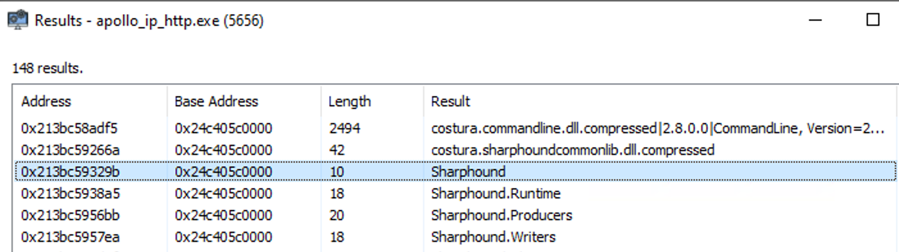
  <figcaption>Figure 7 - "hound" In-Memory String Lookup</figcaption>
</figure>

Needles to say, pre-loading the asembly into memory while staying stealthy is quite challenging. It is even more challenging if you consider that you cannot unload the assembly once it is loaded into memory. 

## execute_assembly
---

So what happens when we execute the pre-loaded assembly from memory? Same deal, a function called `GetFileFromStore` will locate the assembly based on the keyname we stored it with earlier (name of the binary) and decrypt it.

<figure class="centered-image large">
  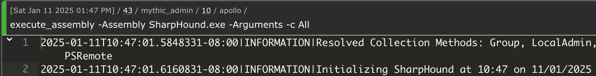
  <figcaption>Figure 8 - execute_assembly Command in Mythic Console</figcaption>
</figure>

Underneath we see a call being made to the function with the keyname as described. 

<figure class="centered-image large">
  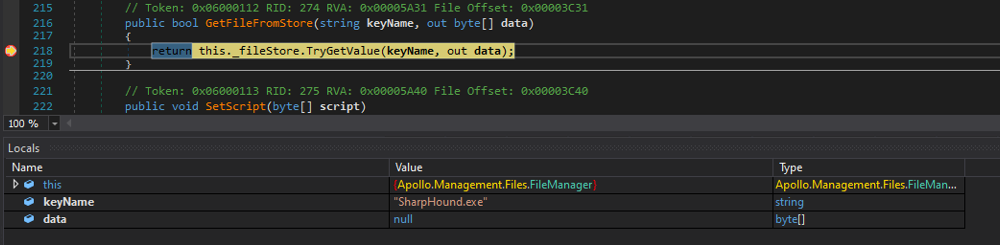
  <figcaption>Figure 9 - SharpHound.exe GetFileFromStore</figcaption>
</figure>

When digging deeper into the memory of the process, we could also find more info about the task executed. And we could even look for the encrypted blob being decrypted in-memory and executed as a task. We will leave this as an exercise for the reader so we can proceed into our story :) .

<figure class="centered-image large">
  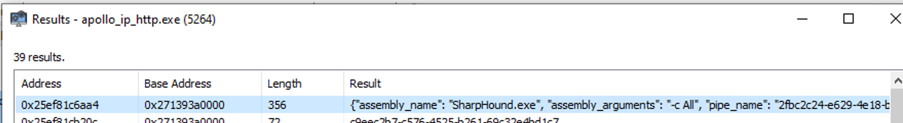
  <figcaption>Figure 10 - Task Information from Memory</figcaption>
</figure>

# Attacking Active Directory
---

Having mapped out the active directory we could now start looking for attack paths. One of the most popular AD attacks is called '**kerberoasting**'. 

<figure class="centered-image">
  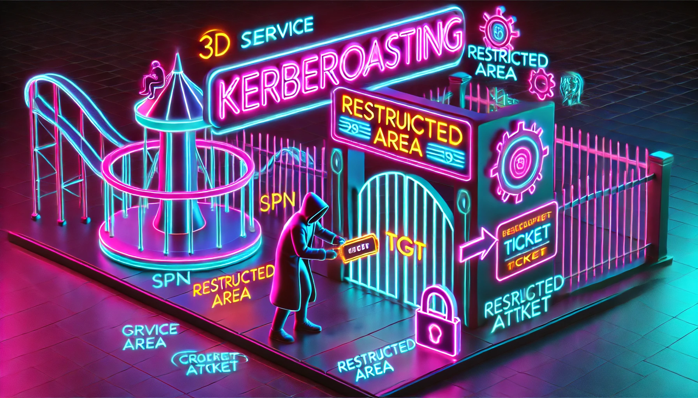
  <figcaption>Figure 12 - Kerberoasting?</figcaption>
</figure>

## An intro to Kerberoasting
---

Kerberoasting is an attack technique in Windows Active Directory (AD) environments that exploits how the Kerberos authentication protocol issues service tickets (known as Ticket-Granting Service (TGS) tickets). By abusing legitimate Kerberos functionality, attackers can harvest TGS tickets for specific service accounts and attempt to crack them offline to recover the corresponding plaintext passwords. Since many service accounts are highly privileged or run critical services, compromising these accounts can lead to lateral movement and, in some cases, full domain compromise.

<figure class="centered-image">
  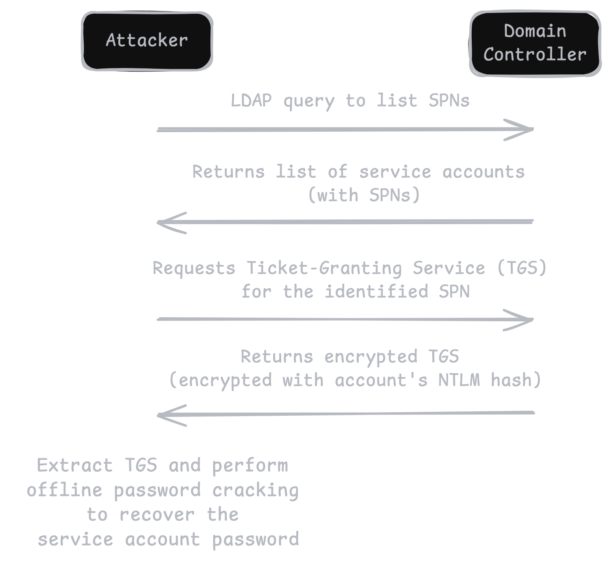
  <figcaption>Figure 13 - Kerberoasting Diagram</figcaption>
</figure>

### Disneyland? 
---

Imagine you arrive at Disneyland (the domain) and purchase a day pass at the main gate (like getting a Ticket-Granting Ticket, or TGT). This day pass proves you've paid for entry (i.e., you’re a legitimate user on the domain), but it doesn’t automatically let you ride every attraction inside.

Inside the park, each ride is a different service (for example, a SQL database, a web service, etc.). In Disneyland terms, these rides are uniquely identified—think of each having its own name or identifier, like Space Mountain or Pirates of the Caribbean. In Kerberos, that’s called the Service Principal Name (SPN). Whenever you want to get on a specific ride, you head to a special ticket booth inside Disneyland (the Domain Controller, or KDC). You present your day pass (the TGT) and ask for a ride-specific ticket—this is the TGS (Ticket-Granting Service ticket).

The booth hands you a special pass for that one ride, but here’s the catch: it’s encrypted (in real Kerberos, it’s encrypted with the service account’s key). The ride operator (the service account) can validate that pass and let you on. In normal Disneyland terms, that’s where the story ends—your ride ticket works, and you have fun.

<figure class="centered-image">
  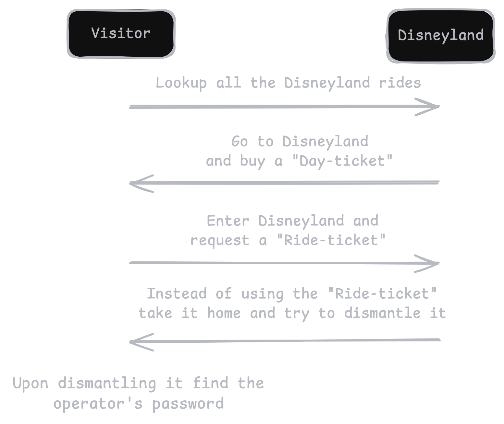
  <figcaption>Figure 14 - Disneyroasting(TM) Diagram</figcaption>
</figure>

However, in Kerberoasting, an attacker uses a perfectly valid Disneyland day pass (any domain account) to collect a bunch of these ride tickets for multiple rides. Each ticket is protected by the operator’s secret “key” (the service account’s password hash), but the attacker takes these tickets home (offline) and tries to crack or guess the ride operator’s secret key (or password) from the ticket. Once the attacker figures out the operator’s key (i.e., recovers the account’s actual password), they basically become that ride’s operator—able to do all sorts of things the operator can do (often with high privileges).

## From theory to practise
---

The core Impacket script for Kerberoasting is [GetUserSPNs.py](https://github.com/fortra/impacket/blob/master/examples/GetUserSPNs.py). It can do two main things:

- Enumerate all users with ServicePrincipalName attributes set.
- Request a Kerberos service ticket (TGS) on behalf of those users, returning an encrypted TGS that can be cracked offline.

<br>As we have access to a Mythic implant we can just use the built-in SOCKS proxy and proxy our attack through the Apollo agent. The agent's command to open a SOCKS5 proxy: `socks -Port 1080`. 

After we [setup our proxychains config](https://medium.com/@psychomong/how-to-set-up-proxychains-a-step-by-step-guide-stay-anonymous-using-terminal-1887609ad633), we run the following command from your attacking (or any machine with Impacket installed):

```python
proxychains4 python3 GetUserSPNs.py redacted.domain/pentest:'SomeStrongPassword123' -dc-ip DC2-REDACTED -request
```

<figure class="centered-image large">
  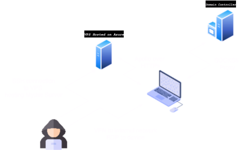
  <figcaption>Figure XX - SOCKS5 Proxy Overview</figcaption>
</figure>

What this does:

- Enumerates all domain accounts with SPNs.
- For each such account, the script requests a TGS ticket from the DC (**OPSEC Unsafe**).
- The DC issues the TGS—encrypted with the service account’s password-derived key.
- The script outputs the relevant hash (in a format that can be fed into cracking tools).

<br>The interesting output, the service ticket looks like this:

```
$krb5tgs$23$*u0813$REDACTED.DOMAIN$REDACTED.DOMAIN/u0813*$6674ddf8(snipped for brevity)275af19
```

Each $krb5tgs$23$... line is a TGS you can crack offline.

### Cracking the Service Ticket
---

Kerberoasting hashes typically use -m 13100 for Kerberos 5 TGS-RESPONSE (RC4-HMAC).

```bash
hashcat -m 13100 -a 0 kerberoast_hashes.txt /usr/share/wordlists/rockyou.txt
```

- `-m 13100` = Kerberos 5 TGS-RESPONSE (type 23)
- `-a 0` = Dictionary attack mode
- `kerberoast_hashes.txt` = Your file with $krb5tgs$... lines
- `/usr/share/wordlists/rockyou.txt` = A common password dictionary

<br>If Hashcat finds any matching passwords, it will display them in the terminal or store them in the potfile. For example, you might see something like:

```
u0813:SomeCrackedPassword123
```

Now what can the low-privileged service account do? Find out in the next episode...

<figure class="centered-image">
  
  <figcaption>Figure XX - Don't leave me hanging</figcaption>
</figure>


# Credits
---
- [Exploring Execute-Assembly: A Deep Dive into In-Memory Threat Execution](https://detect.fyi/exploring-execute-assembly-a-deep-dive-into-in-memory-threat-execution-60adc61aef8)
- [Steal or Forge Kerberos Tickets: Kerberoasting](https://attack.mitre.org/techniques/T1558/003/)