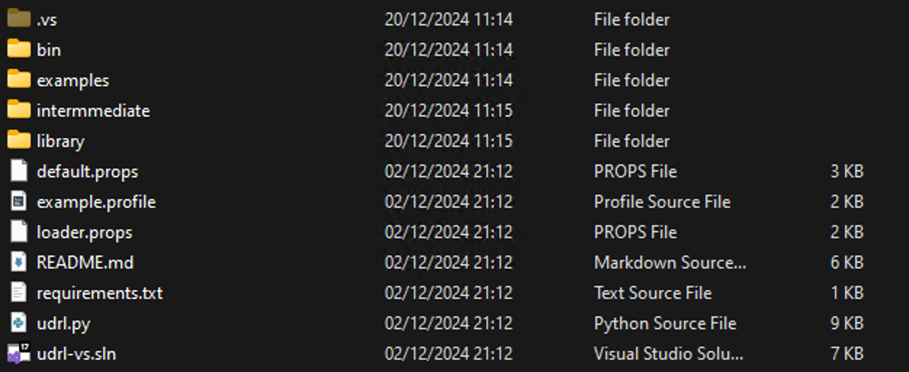

# What I will not explain
---

The intend of this blogpost is not to explain reflective code loading, again. For this I would like to point you to:
- [Cobalt Strike - User Defined Reflective Loader Studies](https://mav3rick33.gitbook.io/the-lab/malware-development/cobalt-strike-user-defined-reflective-loader-studies)
- [IBM X-Force Blogpost](https://securityintelligence.com/x-force/defining-cobalt-strike-reflective-loader/)
- And of course projects such as [AceLdr](https://github.com/kyleavery/AceLdr) , [TitanLdr](https://github.com/realoriginal/titanldr-ng) , [KaynStrike](https://github.com/Cracked5pider/KaynStrike)
- [Reflective Code Loading Mekka](https://github.com/stephenfewer/ReflectiveDLLInjection)

 But rather the development process of a UDRL by someone without a programming background.

Don't take my word for the things I am trying to explain, rather take it with a grain of salt and expect me to be <i>wrong</i> quite often.

<figure class="centered-image">
  
  <figcaption>Figure 1 - Me Exactly Upon Starting This Article</figcaption>
</figure>

# Player Start
---

So how do we start developing our own User-Defined Reflective Loader? We will do what is easiest and use the [udrl-vs kit](https://hstechdocs.helpsystems.com/manuals/cobaltstrike/current/userguide/content/topics/blog_user-def-reflcive-loader-part1.htm?Highlight=udrl-vs) from Forta. 

The kit is included in the Arsenal Kit which you can download from the Cobalt Strike site. 

Inlucded in the udrl-vs kit is the following:

<figure class="centered-image large">
  
  <figcaption>Figure 2 - UDRL-VS Kit Content</figcaption>
</figure>

Browsing the examples we can already see some prepared loaders:
- bud-loader
- default-loader 
- extc2-loader
- obfuscation-loader
- postex-loader

 Let's take a minute to look at the default-loader, compile it and execute it. After compiling the output will be located in the bin file in the project root.

# default-loader
---

This loader is a variant of the default reflective loader of Stephen Fewer. 